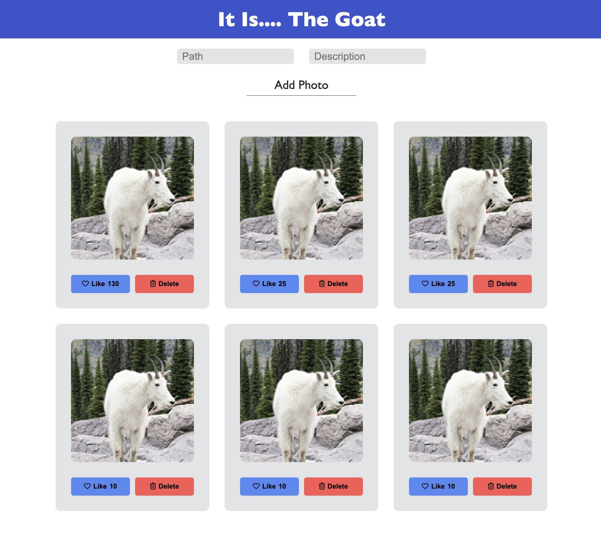

## Project Objective

Use the fundamentals of React to build a gallery app that displays photos.
Allow a user to see the descption when the photo is clicked, and add likes to photos the like

## Features

A user can:

-   Add a photo to the gallery
-   Toggle between seeing the picture and description
-   "Like" photos the enjoy

## What I Learned

-   How to break up a project into components to keep the code DRY
-   Conditional rendering to enhance the user experience
-   JSX syntax "gotchas" which are part of learning a new language ("class" => "className")

## How To Run The Project

-   Database name: `react_gallery`
-   Data: `database.sql`
-   Run `npm install`
-   Run `npm run server`
-   Run `npm run client`

